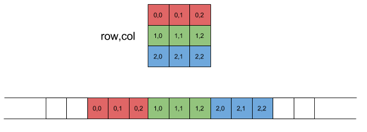
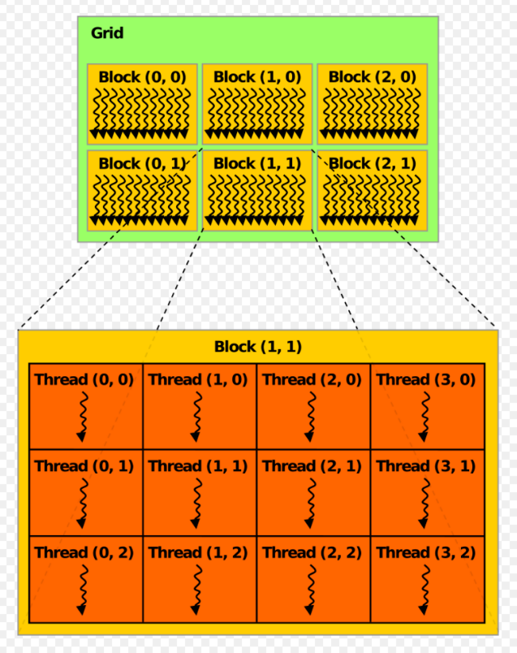
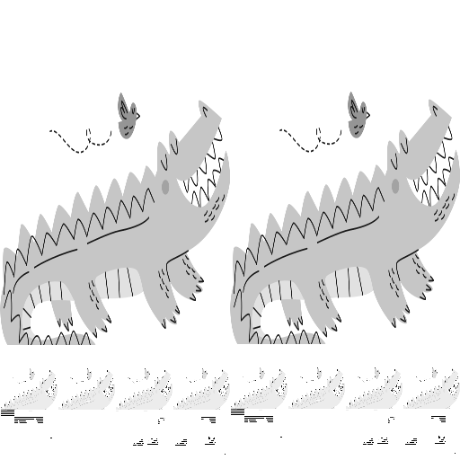
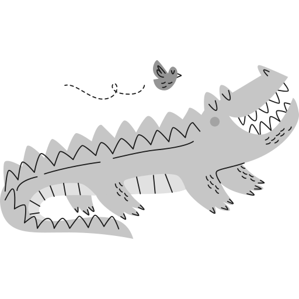

After implementing `vector add` and `softmax` kernels, the next natural progression is matrix multiplication. The most talked about and implemented kernel. But before going there, maybe we can talk about and implement a kernel that works on a multi-dimentional space. Why? because matmul is naturally 2D in AI/ML use cases.

I think nothing is as powerful as image processing to understand 2D space.

The first kernel I have in mind is for converting RGB or RGBA(the A is Alpha, measure of transparency) image to grayscale. The second kernel applies blur filter to an image.

Like always, I suggest implementing the kernels yourself. You may want to take the following intro on how the images are stored on ram, but else than that, you're good to go.

## Representing image in memory
Image is essentially a 2D array. 2D arrays are stored in row-major format in C/C++.

This means for pixel at (x, y), we can find R, G, B, A channels on the following offset:

```c
int linear_index = y*width +x;
int offset = linear_index * channels;
```
The code represents the following structure:



## Understanding blocks and threads in 2D
We can definitely flatten the problem space like the way we do with memory into a single index, but 2d structure matches our problem better.



Have you noticed the dimensions match the mathematics notion of x, y, z?

So for defining sizes we use the following:
```c
dim3 blockSize(bx, by);
dim3 gridSize(gx, gy);
```

Later on the kernel code, we can use the following to find global position of the thread:
```c
int x = blockIdx.x * blockDim.x + threadIdx.x;
int y = blockIdx.y * blockDim.y + threadIdx.y;
int z = blockIdx.z * blockDim.z + threadIdx.z;
```

That's pretty intuitive :).

## Grayscale conversion kernel
Now it's time to convert images to grayscale. I used the following image as my input:


We can use the following kernel code to convert the image to grayscale. 


```c
__global__ void grayScaler(unsigned char *in_d, unsigned char *out_d, int width, int height, int channels)
{
    int x_i = blockIdx.x * blockDim.x + threadIdx.x;
    int y_i = blockIdx.y * blockDim.y + threadIdx.y;

    if (x_i < width && y_i < height)
    {
        int pixeloffset = (y_i * width + x_i);
        int grayoffset = pixeloffset * (channels - 2);
        int color_offset = pixeloffset * channels;
        unsigned char r = in_d[color_offset];
        unsigned char g = in_d[color_offset + 1];
        unsigned char b = in_d[color_offset + 2];
        out_d[grayoffset] = 0.21f * r + 0.71f * g + 0.07f * b;
        if (channels == 4)
            out_d[grayoffset + 1] = in_d[color_offset + 3];
    }
}
```

Channels can be 3 or 4. The 4th channel is transparency. In case of grayscaling, the 4th channel in RGBA, translates directly to the second channel of grayscaled image. Like always you can find the code under `source-code/image` folder.

In my first try I got this:


If you see something like this, it's definitely because the memory addressing was wrong, working a bit to debug the code will get you to the correct image:



## Cuda memory allocation and copy
We do not use Torch Tensors in this code. So we should do the memory allocation on the GPU and transfer of data to the device manually.

```c
unsigned char *d_data;
cudaError_t cuda_status = cudaMalloc((void **)&d_data, size);
if (cuda_status != cudaSuccess)
{
    fprintf(stderr, "cudaMalloc input failed! Error: %s\n", cudaGetErrorString(cuda_status));
    return 1;
}

cuda_status = cudaMemcpy(d_data, data, size, cudaMemcpyHostToDevice);
if (cuda_status != cudaSuccess)
{
    fprintf(stderr, "cudaMemcpyHostToDevice failed! Error: %s\n", cudaGetErrorString(cuda_status));
    return 1;
}
```

You will need to transfer the image to the device, and tranfer back the final image to the host. For `cudaMemcpy` we have these modes:


- cudaMemcpyHostToDevice
- cudaMemcpyDeviceToHost
- cudaMemcpyDeviceToDevice

the `DeviceToDevice` is the cool part. Imagine you have a machine with 8 x H100 GPUs that are connected together with NVLink. This command automatically detects if NVLink is available, and if not it falls back to PCIe peer to peer.

## Outro
I'm confident after half a day of struggling you will implement the Grayscale and Blur filtering kernel. I don't think there is new things that I can add as explanation, will let you get your hands dirty. I've added codes to the source-code/images directory. You can use it if you want some inspiration.