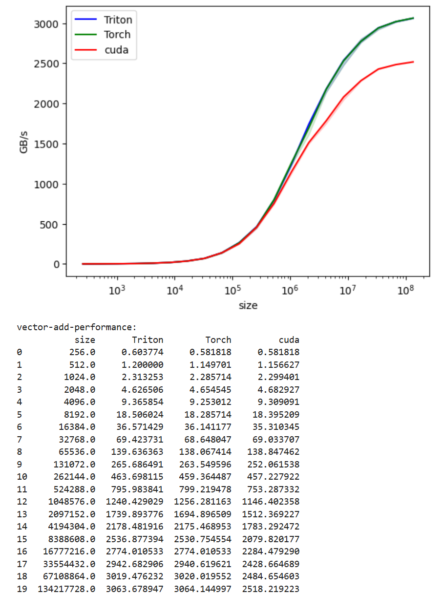

We've reach a sweet place! Where we can see kernels in action and how they compare together.

First, let's copy paste and annotate the code in Triton tutorial:

```python
# This decorator sets up a comprehensive performance comparison across different implementations

@triton.testing.perf_report(
    triton.testing.Benchmark(
        # X-axis configuration: the independent variable we're testing
        x_names=['size'],  # Parameter name that varies across benchmark runs
        x_vals=[2**i for i in range(8, 28, 1)],  # Test sizes from 2^8 (256) to 2^27 (134M) elements
        x_log=True,  # Use logarithmic scale for x-axis (better for exponential ranges)
        
        # Line configuration: compare different implementations
        line_arg='provider',  # Parameter that distinguishes different implementations
        line_vals=['triton', 'torch', 'cuda'],  # Internal identifiers for each implementation
        line_names=['Triton', 'Torch', 'cuda'],  # Display names for the legend
        styles=[('blue', '-'), ('green', '-'), ('red', '-')],  # (color, line_style) tuples
        
        # Plot configuration
        ylabel='GB/s',  # Y-axis label (measuring memory bandwidth)
        plot_name='vector-add-performance',  # Output filename and plot title
        args={},  # Additional fixed arguments (empty here since we only vary size/provider)
    ))
    # basically, the above decorator says that I'm going to have a 2D Diagram
    # x values would be 'size' and lines would be triton, torch and cuda.
def benchmark(size, provider):
    """
    Benchmarks vector addition across three implementations: PyTorch, Triton, and CUDA.
    
    Args:
        size: Number of elements in the vectors
        provider: Which implementation to benchmark ('torch', 'triton', or 'cuda')
    
    Returns:
        Tuple of (median_gbps, min_gbps, max_gbps) representing bandwidth at different quantiles
    """
    # Create random input tensors on the specified device
    x = torch.rand(size, device=DEVICE, dtype=torch.float32)
    y = torch.rand(size, device=DEVICE, dtype=torch.float32)
    
    # Quantiles for statistical analysis: [median, 20th percentile, 80th percentile]
    # This captures the distribution of timings across multiple runs
    quantiles = [0.5, 0.2, 0.8]
    
    # Benchmark each implementation
    # do_bench runs the lambda multiple times and returns timing statistics
    if provider == 'torch':
        # Native PyTorch element-wise addition
        ms, min_ms, max_ms = triton.testing.do_bench(lambda: x + y, quantiles=quantiles)
    if provider == 'triton':
        # Custom Triton kernel implementation
        ms, min_ms, max_ms = triton.testing.do_bench(lambda: add(x, y), quantiles=quantiles)
    if provider == 'cuda':
        # Custom CUDA kernel implementation
        ms, min_ms, max_ms = triton.testing.do_bench(lambda: add_cuda(x, y), quantiles=quantiles)
    
    # Calculate memory bandwidth in GB/s
    # Formula breakdown:
    #   - 3 * x.numel(): total elements accessed (read x, read y, write output)
    #   - x.element_size(): bytes per element (4 bytes for float32)
    #   - 1e-9: convert bytes to gigabytes
    #   - (ms * 1e-3): convert milliseconds to seconds
    gbps = lambda ms: 3 * x.numel() * x.element_size() * 1e-9 / (ms * 1e-3)
    
    # Return bandwidth for median, fastest (max_ms → min bandwidth), and slowest (min_ms → max bandwidth)
    # Note: max_ms gives min bandwidth and vice versa
    return gbps(ms), gbps(max_ms), gbps(min_ms)
```

I hope annotations are good enough, still there are some questions it doesn't answer.

## Why we're using do_bench?
Alternative options are time.time() or time.perf_counter(). There are issues with these methods:
- GPU execution is asynchronous, so we should back in cuda synchronize.
- No warm ups, so we should add some lines for warm ups.
- Single measurements are noisy, so we should do many counts.

# Results
Awesome, now let's see the results.

## GTX1080

## GTX5060
You can see a perf bump in the middle with this GPU type. I tried with Claude Sonnet to understand why this is happening, but no real good answers. Please share if you know the cause.

## A100-40GB

## H100-SXM
This is the interesting graph, paid for H100 GPU to generate this. You can see the Cuda version is way behind the Triton and Torch implementation. Why? We are going to investigate in the next article.

