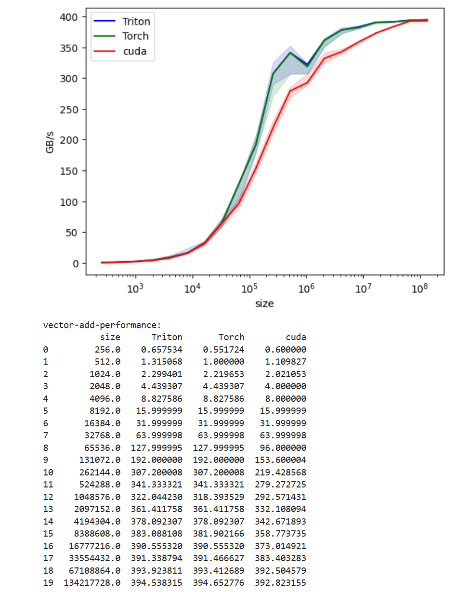
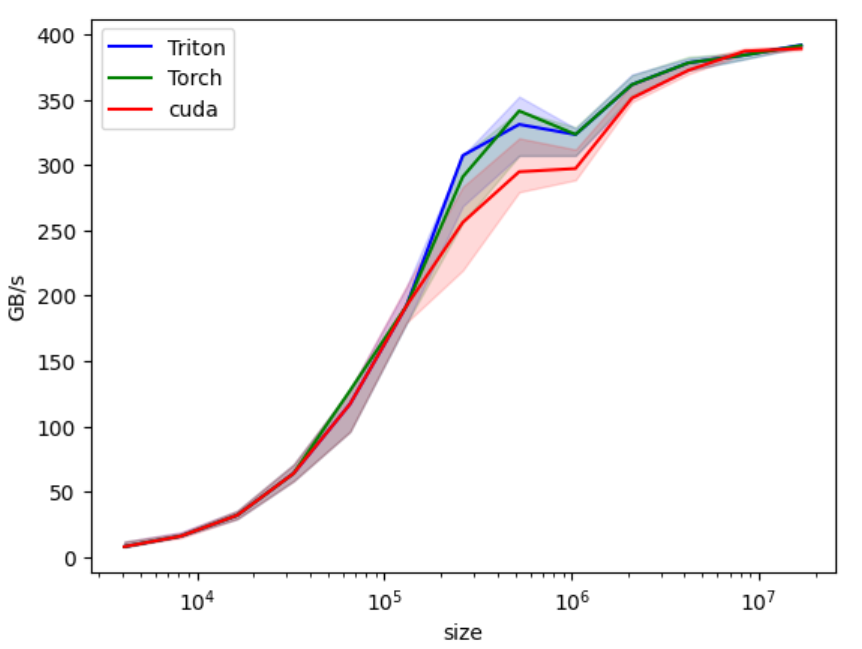
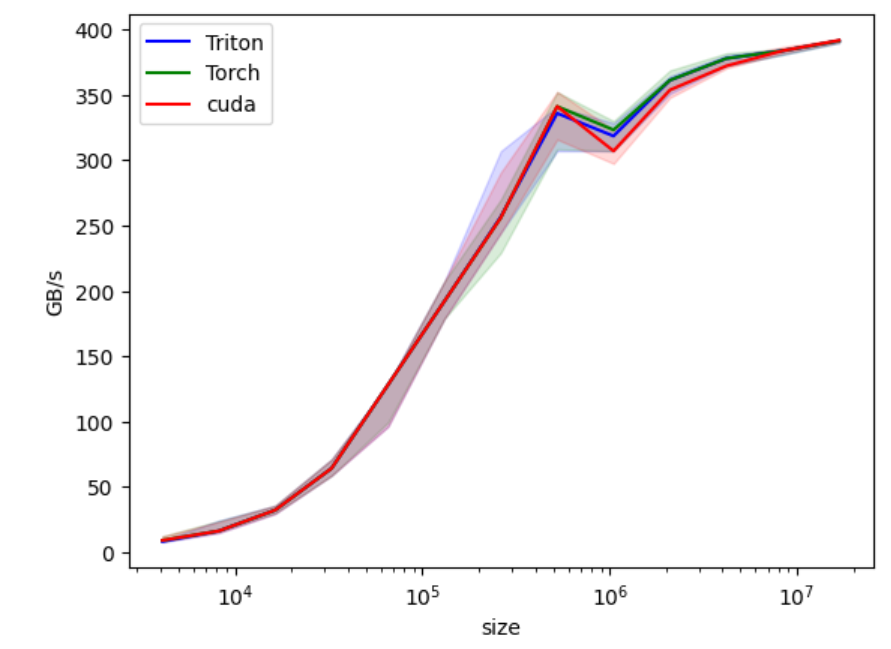
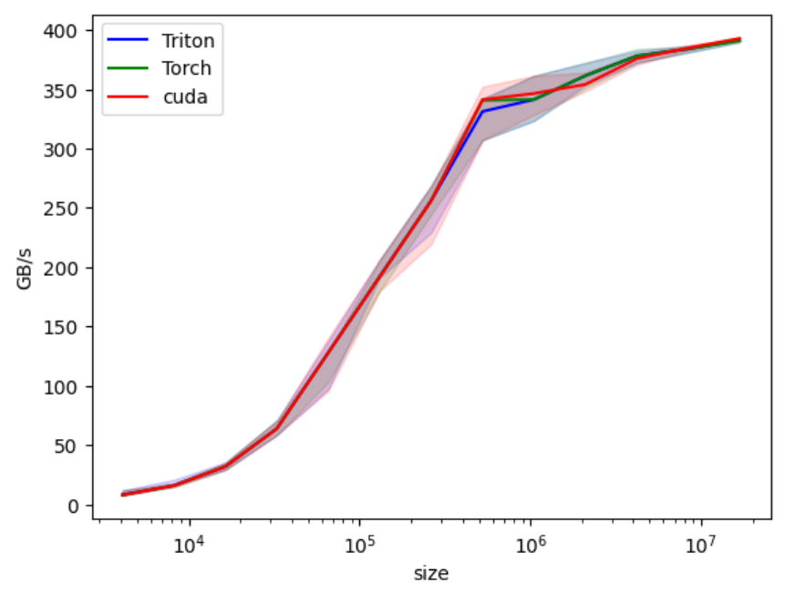

I'm sure from last post you remember our vector addition kernel in Cuda was behind Triton & Torch version.
Well that shows the beauty of how Triton compiler automatically optimizes the kernels.
Here is our kernel performance on RTX5060:


First things first, let's play with threads number. After all, that's the only number we have.

```cpp
#include <ATen/ATen.h>          // ATen: PyTorch Tensor library (like numpy)
#include <c10/cuda/CUDAGuard.h> // Ensures we're on the right GPU device
#include <c10/cuda/CUDAStream.h>// manages Cuda execution streams
#include <cuda_runtime.h>       // Core Cuda functionality
#include <torch/extension.h>    // Magic glue between C++ and Python

extern "C" void launch_add_kernel(const float *x, const float *y, float *out,
                                  int n, int blocks, int threads,
                                  cudaStream_t stream);

at::Tensor add_cuda(at::Tensor x, at::Tensor y) {
  TORCH_CHECK(x.sizes() == y.sizes(), "x and y must have the same shape")

  auto out = torch::empty_like(x);
  int64_t n_elements = x.numel();

  const int threads = 64; // Threads per block (multiple of 32: warp friendly!)
  const int blocks = (int)((n_elements + threads - 1) / threads);

  const float *x_ptr = x.data_ptr<float>();
  const float *y_ptr = y.data_ptr<float>();
  float *out_ptr = out.data_ptr<float>();

  cudaStream_t stream = c10::cuda::getCurrentCUDAStream();
  launch_add_kernel(x_ptr, y_ptr, out_ptr, (int)n_elements,
                    blocks, threads, stream);
  return out;
}

/* PYBIND11_MODULE: This makes the function callable in Python
 * the 11 in the name means C++11 at minimum
 * Funny enough, there is no other numbers.
 *
 * TORCH_EXTENSION_NAME: Automatically set by Pytorch build system
 */
PYBIND11_MODULE(TORCH_EXTENSION_NAME, m){
  m.def("add_cuda", &add_cuda, "Vector add (CUDA)");
}
```

With this, we do observe some perf improvement. We're closer to Triton and Torch version.


## Vectorized Memory Access and Warp-Level Efficiency
Looking at [RTX 5060 specs](https://www.nvidia.com/en-us/geforce/graphics-cards/50-series/rtx-5060-family/), we can see `Memory Interface Width` is 128-bits. The current kernel loads 1 float at a time, that's 4Bytes or 32 bits per transaction. We are effectively underutilizing the bandwidth, leaving 75% of it empty. Now, what if we load 4xfloats (4x32=128bit) at the same time to saturate the 128 bits?

Briliant idea, huh? Nvidia has some built it types for multiple of floats:
| Type    | Elements | Total Size | Alignment Requirement |
|----------|-----------|-------------|------------------------|
| `float1` | 1         | 4 bytes     | 4 bytes                |
| `float2` | 2         | 8 bytes     | 8 bytes                |
| `float3` | 3         | 12 bytes    | 16 bytes (padded to 16)|
| `float4` | 4         | 16 bytes    | 16 bytes               |

We're going to use `float4`. Here is the new kernel:
```cpp
/**
 * Vectorized CUDA kernel for element-wise vector addition using float4.
 *
 * Each thread processes 4 consecutive floats at once (16 bytes total).
 * This improves memory bandwidth utilization and reduces the number
 * of global memory transactions compared to the scalar version.
 */

__global__ void add_kernel_vec4(const float *__restrict__ x,
                                const float *__restrict__ y,
                                float *__restrict__ out,
                                int n) {

    // Compute the global index for this thread.
    // Each thread handles 4 elements, so multiply by 4.
    int idx = (blockIdx.x * blockDim.x + threadIdx.x) * 4;

    // Ensure we stay within array bounds.
    // "idx + 3 < n" because each thread touches elements [idx, idx+1, idx+2, idx+3].
    if (idx + 3 < n) {

        // Reinterpret the float* as a float4*.
        // This allows us to load 4 floats (16 bytes) in a single transaction.
        float4 a = reinterpret_cast<const float4*>(x)[idx / 4];
        float4 b = reinterpret_cast<const float4*>(y)[idx / 4];

        // Perform element-wise addition on the 4 packed floats.
        float4 c;
        c.x = a.x + b.x;
        c.y = a.y + b.y;
        c.z = a.z + b.z;
        c.w = a.w + b.w;

        // Store the result back to global memory as a single 16-byte store.
        reinterpret_cast<float4*>(out)[idx / 4] = c;
    }
}
```

Now, we should change the `vector_add.cpp` file to accomodate for changes:

```cpp
    int threads = 64;
    int blocks = (n_elements/4 + threads - 1) / threads;
```

This will close the gap we saw in the middle of the chart. We didn't see this gap in lower array sizes because the kernel launch was bottleneck in lower array sizes.


## Adding grid-stride loop
We're pretty close, just there is some gaps in the middle. As I was trying this on a different RTX 5060, the graph is different.

In the previous version, we went from launching 1 kernel per float, to 1 kernel per 4 floats and observed a good performance gain. With the new approach,
we are launching just one kernel to do addition over loop. So all of the array will be calculated over just one launch.

As ChatGPT puts it, here is the difference:
The first version:
```
Time ───────────────────────────────────────────────▶

Thread 0: [LOAD x0,y0]──(wait 400 cycles)──[ADD]──[STORE]
Thread 1: [LOAD x1,y1]──(wait 400 cycles)──[ADD]──[STORE]
Thread 2: [LOAD x2,y2]──(wait 400 cycles)──[ADD]──[STORE]
...
Warp Scheduler: switches between warps, but most are waiting on memory

```


The grid-stride loop version:
```
Time ─────────────────────────────────────────────────────────▶

Thread 0: [LOAD x0,y0][LOAD x4,y4][LOAD x8,y8] ... (pipeline full)
            ↑ while one load waits, next loads issued
Thread 1: [LOAD x1,y1][LOAD x5,y5][LOAD x9,y9] ...
Thread 2: [LOAD x2,y2][LOAD x6,y6][LOAD x10,y10] ...
...
Warp Scheduler: always finds ready warps (no idle gaps)

```


Here is the .cu code:
```cpp
/**
 * Vectorized grid-stride CUDA kernel for element-wise vector addition.
 *
 * Each thread now processes multiple float4 blocks (16 bytes each)
 * in a grid-stride loop.  This improves memory-latency hiding
 * and SM utilization, especially for mid-sized arrays.
 */
__global__ void add_kernel_vec4_looped(const float *__restrict__ x,
                                       const float *__restrict__ y,
                                       float *__restrict__ out,
                                       int n) {
    // Thread’s global linear index
    int tid = blockIdx.x * blockDim.x + threadIdx.x;
    // Total number of threads across the grid
    int stride = blockDim.x * gridDim.x;

    // Grid-stride loop: each iteration handles one float4 (4 floats)
    for (int i = tid * 4; i < n; i += stride * 4) {
        if (i + 3 < n) {
            // Vectorized 16-byte load
            float4 a = reinterpret_cast<const float4*>(x)[i / 4];
            float4 b = reinterpret_cast<const float4*>(y)[i / 4];

            // Compute
            float4 c;
            c.x = a.x + b.x;
            c.y = a.y + b.y;
            c.z = a.z + b.z;
            c.w = a.w + b.w;

            // Vectorized 16-byte store
            reinterpret_cast<float4*>(out)[i / 4] = c;
        }
    }
}

```


