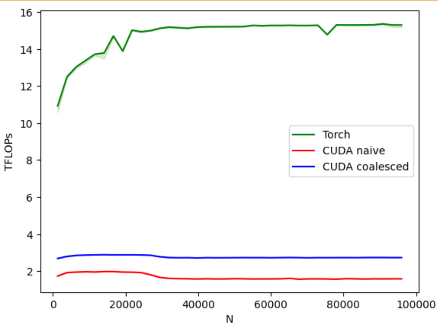

After implementing 2D image kernel, maybe now it's time to implement matmul.

I suggest going ahead and implementing your Cuda version of Matmul. This one is going to be hard, so probably you'll need some help from ChatGPT.

Here is my version:

```cpp
__global__ void matmul_kernel_cache(float *out, const float *a, const float *b,
                                    int M, int N, int K)
{
    int row = blockIdx.y * blockDim.y + threadIdx.y;
    int col = blockIdx.x * blockDim.x + threadIdx.x;

    __shared__ float sA[TILE_WIDTH][TILE_WIDTH], sB[TILE_WIDTH][TILE_WIDTH];
    if (row < M && col < N)
    {
        int numTiles = (K + TILE_WIDTH - 1) / TILE_WIDTH;
        float pVal = 0;
        for (int t = 0; t < numTiles; t++)
        {
            int A_row = row;
            int A_col = t * TILE_WIDTH + threadIdx.x;
            if (A_row < M && A_col < K)
                sA[threadIdx.y][threadIdx.x] = a[A_row * K + A_col];
            else
                sA[threadIdx.y][threadIdx.x] = 0;

            int B_row = t * TILE_WIDTH + threadIdx.y;
            int B_col = col;
            if (A_row < M && A_col < K)
                sB[threadIdx.y][threadIdx.x] = b[B_row * N + B_col];
            else
                sB[threadIdx.y][threadIdx.x] = 0;

            __syncthreads();

            for (int j = 0; j < TILE_WIDTH; j++)
                pVal += sA[threadIdx.y][j] * sB[j][threadIdx.x];
            __syncthreads();
        }
        out[row * N + col] = pVal;
    }
}
```

This kernel is good for the start. But if you remember, we have a way to optimize it. Lowering memory bottleneck by transferring data in 4 bits.

```cpp
__global__ void matmul_kernel_cache_coalescing(float *out, const float4 *a, const float4 *b_T,
                                               int M, int N, int K)
{
    int row = blockIdx.y * blockDim.y + threadIdx.y;
    int col = blockIdx.x * blockDim.x + threadIdx.x;

    if (row < M && col < N)
    {
        int K4 = (K + 3) / 4;

        int numTiles = (K4 + TILE_WIDTH - 1) / TILE_WIDTH;

        __shared__ float4 sA[TILE_WIDTH][TILE_WIDTH], sB[TILE_WIDTH][TILE_WIDTH];
        float pVal = 0;
        for (int t = 0; t < numTiles; t++)
        {
            int a_kchunk = t * TILE_WIDTH + threadIdx.x;
            int b_kchunk = t * TILE_WIDTH + threadIdx.y;

            if (a_kchunk < K4)
                sA[threadIdx.y][threadIdx.x] = a[row * K4 + a_kchunk];
            else
                sA[threadIdx.y][threadIdx.x] = make_float4(0.f, 0.f, 0.f, 0.f);

            if (b_kchunk < K4)
                sB[threadIdx.y][threadIdx.x] = b_T[col * K4 + b_kchunk];
            else
                sB[threadIdx.y][threadIdx.x] = make_float4(0.f, 0.f, 0.f, 0.f);

            __syncthreads();

            for (int j = 0; j < TILE_WIDTH; j++)
            {
                float4 va = sA[threadIdx.y][j];
                float4 vb = sB[j][threadIdx.x];

                pVal += va.x * vb.x + va.y * vb.y + va.z * vb.z + va.w * vb.w;
            }
            __syncthreads();
        }
        out[row * N + col] = pVal;
    }
}
```
Probably you've noticed that access pattern is different for B, that's because we're passing it the Transposed version. You'd ask why? Because we're using float4, we're moving over 4 consecutive floats. This won't work for B that is access column-wise for matmul.

This is the code to apply Transpose to the matrix:

```cpp
auto bT = b.transpose(0, 1).contiguous();
    TORCH_CHECK(reinterpret_cast<uintptr_t>(bT.data_ptr<float>()) % 16 == 0,
                "Tensor B is not 16-byte aligned");
    const float4 *b_T_ptr = reinterpret_cast<const float4 *>(bT.data_ptr<float>());
```

You might think, that's bulls eye. The performance now is going to be the best. I should break to you: NO. Performance is still bad, just slightly better. I think through the years of using MATMUL, just writing a randomly optimize kernel won't cut it. You can check the performance in the following image:



I may get back to this subject, but would love to keep going forward.