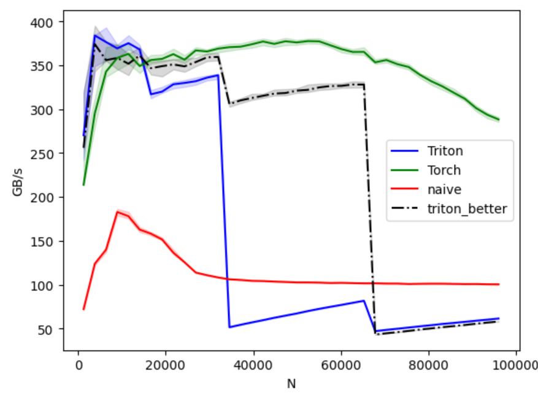

Maybe instead of just diving right into it, I can give some intro. Just to grasp why Fused softmax is important.

Model output is an array of unbounded real numbers we call logits. like the following:
$$
x=[2.0,1.0,0.1]
$$

The larger the logit, shows model's preference towards that token. If we want our model to act greedy, we can just apply an argmax over the array and the most preferred token. But, in reality things are different. Both inference and training need probabilities as output. That's where `Softmax` comes into picture.

$$
\text{Softmax}(x_i) = \frac{e^{x_i}}{\sum_{j=1}^{N} e^{x_j}}
$$

So:
$$
e^{x} = [e^2, e^1, e^{0.1}] \approx [7.389, 2.718, 1.105]
$$

$$
\text{Sum} = 7.389 + 2.718 + 1.105 = 11.212
$$

Then:
$$
\text{Softmax}(x) = 
\left[
\frac{7.389}{11.212},
\frac{2.718}{11.212},
\frac{1.105}{11.212}
\right]
\approx [0.659, 0.242, 0.099]
$$
Now they look like probabilities — they’re positive, sum to 1, and the largest score (2.0) has the highest probability.

### Stable softmax flavor

That's good, but it might not be numerically stable. For example for the following:

$$
x = [1000, 999, 998]
$$

Computing $$ e^{1000} $$ would overflow. Because it translates to an astronomically large number.

To avoid this, we use the numerically stable version:

$$
\text{Softmax}(x_i) = \frac{e^{x_i - \max(x)}}{\sum_{j} e^{x_j - \max(x)}}
$$

Here, $$ \max(x) = 1000 $$, so we subtract it:

$$
x - \max(x) = [0, -1, -2]
$$

This makes the final version to the following probabilities that is pretty stable:

$$
\text{Softmax}(x) = [0.665, 0.245, 0.090]
$$

Love it, huh?

# Naive implementation

Now let's do naive implementation and count array reads.

My suggestion is to try to open up a notebook and do it yourself. You can reference the above stable softmax formula. When you're done, you can get back here or [triton tutorials page](https://triton-lang.org/main/getting-started/tutorials/02-fused-softmax.html#motivations) to compare and fix.

We need you to build up this knowledge, we will use it to implement the Triton version and later the Cuda version.

Ok, this is my version, which is slightly different that the triton tutorial version:

```python
import torch
def naive_softmax(x):
    M, N = x.shape
    # read MN elements, write M elements
    max_mem = torch.max(x, dim=-1).values
    # read MN + M elements, write MN elements
    z = x - max_mem.unsqueeze(-1).expand(M, N)
    # read MN elements, write MN elements
    z = torch.exp(z)
    # read MN elements, write M elements
    row_sum = torch.sum(z,-1).unsqueeze(-1).expand(M, N)
    # read MN + M elements, write MN elements
    result = z/row_sum
    # Total:: Read: 5MN + 2M; Write: 3MN+2M
    return result
```

I've also annotated it with number of reads and writes.

# Triton Implementation
Now that we have this, do you think we can implement Triton without getting much help from the Triton tutorial?

TBH, I'm not sure, but worths trying. With a some help from Gemini AI, got to this:

```python
@triton.jit
def softmax_kernel(output_ptr, input_ptr, input_row_stride, output_row_stride, n_rows, n_cols, BLOCK_SIZE: tl.constexpr):
    # tl.device_print("BLOCK_SIZE", BLOCK_SIZE)
    pid = tl.program_id(0)
    row_start_ptr = input_ptr + pid * input_row_stride
    col_offsets = tl.arange(0, BLOCK_SIZE)
    input_ptrs = row_start_ptr + col_offsets
    # Load the row data into a block. Use a mask for rows shorter than BLOCK_SIZE.
    mask = col_offsets < n_cols
    row = tl.load(input_ptrs, mask=mask, other=-float('inf'))
    row_max = tl.max(row, axis=0)
    numerator = tl.exp(row - row_max)
    denominator = tl.sum(numerator, axis=0)
    output = numerator / denominator
    
    # Store the result back to global memory.
    output_ptrs = output_ptr + pid * output_row_stride + col_offsets
    tl.store(output_ptrs, output, mask=mask)

def triton_softmax(x: torch.Tensor):
    if not x.is_cuda:
        x = x.cuda()

    n_rows, n_cols = x.shape
    output = torch.empty_like(x)
    grid = (n_rows,)

    softmax_kernel[grid](
        output_ptr=output, 
        input_ptr=x, 
        input_row_stride=x.stride(0),
        output_row_stride=output.stride(0),
        n_rows=n_rows,
        n_cols=n_cols,
        BLOCK_SIZE=triton.next_power_of_2(n_cols)
    )
    
    return output
```

You can see it's pretty naive, we are launching 1 kernel per row.

## Benchmark
I've added the Triton tutorial's kernel (let's call it BTK-Better Triton Kernel) to see how I'm comparing with a complex kernel.

As I'm using RTX5060, the BTK was getting to OOM (out of memory) pretty fast, so I lowered the `num_stages = 1`.

Now, let's see the result:


The good news is that my Triton kernel was better than everyone from the beginning up to $$ N=14080 $$.Bad news is that I don't know if any model is having vocab_size equal or less than that amount these days. For context, M is batchsize, N is vocabsize in real world applications. Modern models like DeepSeek R1 have $$ vocab-size=128k $$. But let's say I stood a chance sometime in the history of LLMs.

The BTK dies sometime after my kernel is gone. But damn, Torch goes strong.

For the next article, I don't know, should I put some time to optimize the current kernel or just go to Cuda?