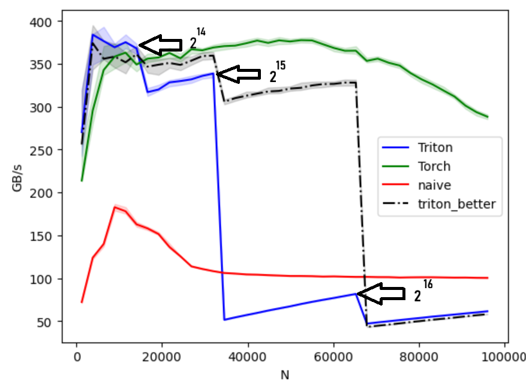
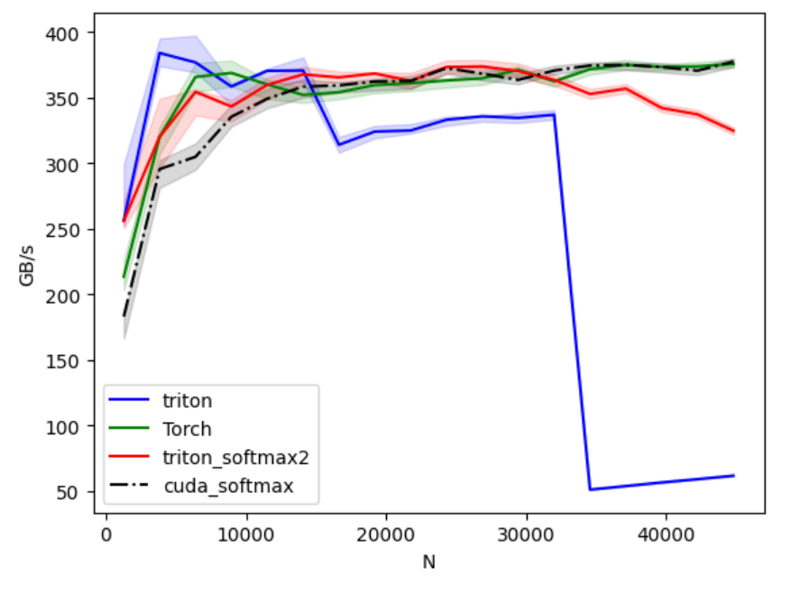

As much as I wanted to let it go and jump into Cuda kernel implementation, I couldn't. That nagging voice that says let's see why triton kerenel drops dead.

Now let's get into it. Zooming in, noticed that drops occurs on exact powers of 2.


Looking at the code, we can see why it happens:

```python
BLOCK_SIZE=triton.next_power_of_2(n_cols)
```

We're good up to $$ 2^{14} $$ then we have a drop. With in $$ 2^{15} $$ band we see the performance is getting better until we hit $$ 2^{16} $$. That's because early in $$ 2^{15} $$ band we are just utilizing parts of the block, the rest are masked away; lowering the effective bandwidth.

I tried different ways to fix the issue, but wasn't successful. May get back to it after writing the Cuda version.

## Update
After implementing the Cuda version and learning a bit about some parallel work that we can do; I had another stab at it.

The following is better than our original kernel. The red line (triton_softmax2) is the new kernel.


Enabled autotuning on of the parameters and got the following:


It's much better. If we combine it with the initial triton kernel which is much better for lower row sizes; we do easily surpass or match torch for row sizes up to 29,440.

Here the improved softmax triton kernel so far:
```python
@triton.autotune(
    configs=[
        triton.Config({'BLOCK_SIZE': 512,  'VEC': 2, 'num_warps': 4, 'num_stages': 1}),
        triton.Config({'BLOCK_SIZE': 1024, 'VEC': 2, 'num_warps': 4, 'num_stages': 2}),
        triton.Config({'BLOCK_SIZE': 1024, 'VEC': 4, 'num_warps': 4, 'num_stages': 1}),
        triton.Config({'BLOCK_SIZE': 2048, 'VEC': 4, 'num_warps': 8, 'num_stages': 2}),
        triton.Config({'BLOCK_SIZE': 512,  'VEC': 4, 'num_warps': 8, 'num_stages': 1}),
        # wide rows
        triton.Config({'BLOCK_SIZE': 4096,  'VEC': 4, 'num_warps': 8,  'num_stages': 2}),
        triton.Config({'BLOCK_SIZE': 8192,  'VEC': 4, 'num_warps': 8,  'num_stages': 2}),
        triton.Config({'BLOCK_SIZE': 8192,  'VEC': 4, 'num_warps': 16, 'num_stages': 2}),
        triton.Config({'BLOCK_SIZE': 16384, 'VEC': 4, 'num_warps': 8,  'num_stages': 3}),
        triton.Config({'BLOCK_SIZE': 4096,  'VEC': 4, 'num_warps': 16, 'num_stages': 3}),
    ],
    key=['n_cols']
)
@triton.jit
def softmax_rowwise(
    out_ptr, in_ptr,
    in_row_stride, out_row_stride,
    n_cols: tl.int32,
    BLOCK_SIZE: tl.constexpr,  # elements per program, across the whole row, processed in tiles
    VEC: tl.constexpr          # per-thread vector width, use 4 when alignment allows
):
    pid = tl.program_id(0)
    row_in  = in_ptr  + pid * in_row_stride
    row_out = out_ptr + pid * out_row_stride

    # Online pass 1: compute row max and normalizer without storing intermediates
    m = tl.full((), -float('inf'), tl.float32)   # running max
    s = tl.zeros((), tl.float32)                 # running sum of exp(x - m)

    # Tile over columns in steps of BLOCK_SIZE*VEC
    tile_span = BLOCK_SIZE * VEC
    n_tiles = (n_cols + tile_span - 1) // tile_span  # runtime integer division
    for tile_start in range(0, n_tiles):
        cols = tile_start * tile_span + tl.arange(0, BLOCK_SIZE * VEC)
        mask = cols < n_cols
        ptrs = row_in + cols

        # Help the compiler vectorize. If your rows are contiguous and 16-byte aligned this will trigger float4-style ld/st.
        tl.multiple_of(cols, VEC)          # per-thread lane is contiguous
        # tl.assume_aligned(ptrs, 16)        # encourage 128-bit memory ops

        x = tl.load(ptrs, mask=mask, other=-float('inf'))

        # local max for this tile
        tile_max = tl.max(x, axis=0)
        m_new = tl.maximum(m, tile_max)

        # rescale the running sum to the new max, then add this tile’s contribution
        s = s * tl.exp(m - m_new) + tl.sum(tl.exp(x - m_new), axis=0)
        m = m_new

    # Pass 2: write normalized output
    inv_s = 1.0 / s
    for tile_start in range(0, n_tiles):
        cols = tile_start * tile_span + tl.arange(0, BLOCK_SIZE * VEC)
        mask = cols < n_cols
        ptrs = row_in + cols

        tl.multiple_of(cols, VEC)
        # tl.assume_aligned(ptrs, 16)

        x = tl.load(ptrs, mask=mask, other=-float('inf'))
        y = tl.exp(x - m) * inv_s
        tl.store(row_out + cols, y, mask=mask)


def triton_softmax2(x):
    import torch
    if not x.is_cuda:
        x = x.cuda(non_blocking=True)
    n_rows, n_cols = x.shape
    out = torch.empty_like(x)
    grid = (n_rows,)
    softmax_rowwise[grid](
        out_ptr=out,
        in_ptr=x,
        in_row_stride=x.stride(0),
        out_row_stride=out.stride(0),
        n_cols=n_cols,
    )
    return out
```

As much as I would like to work more on the optimization, I'm going to throw the towel.
Maybe I will get back to these later.