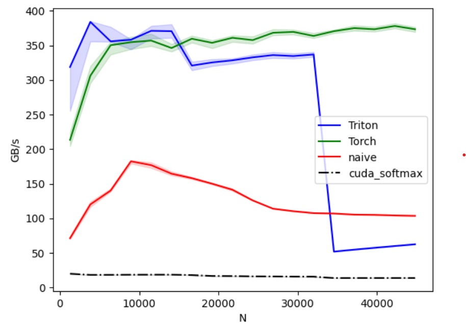
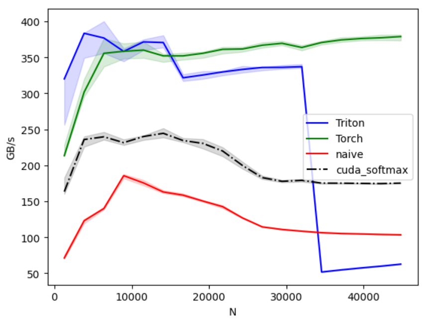
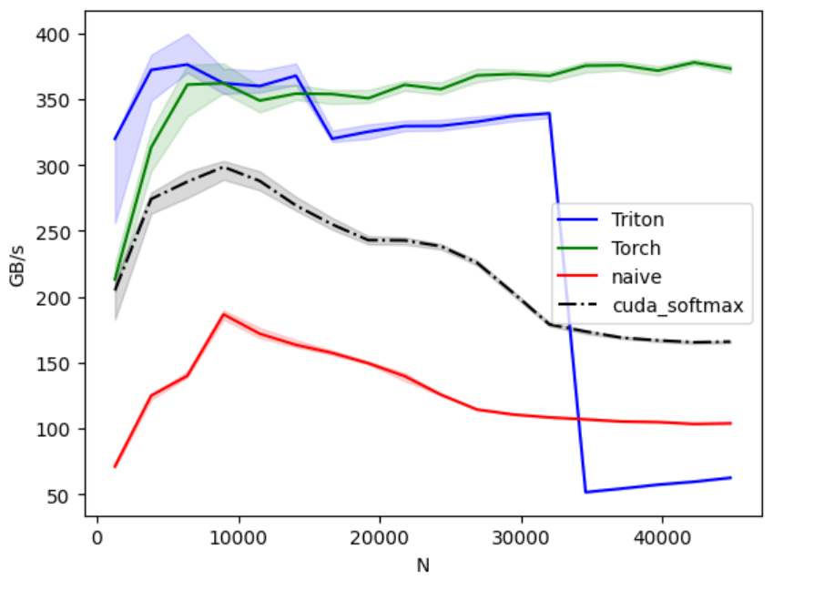
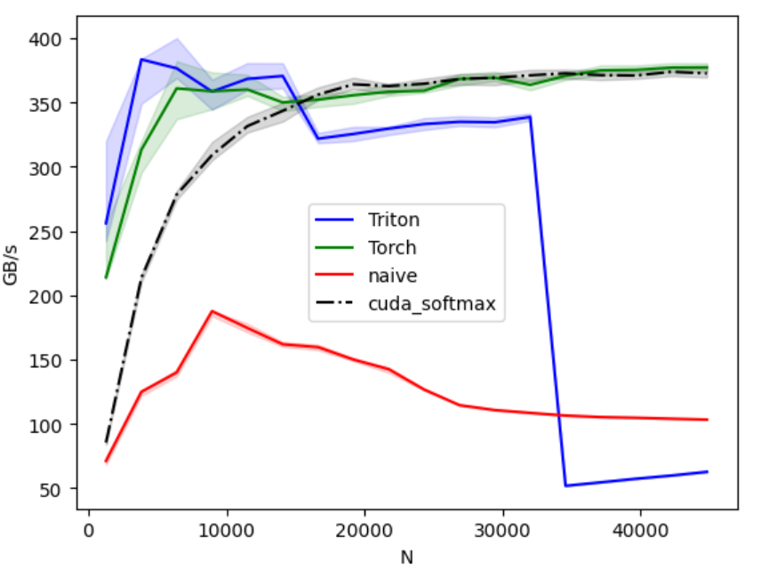
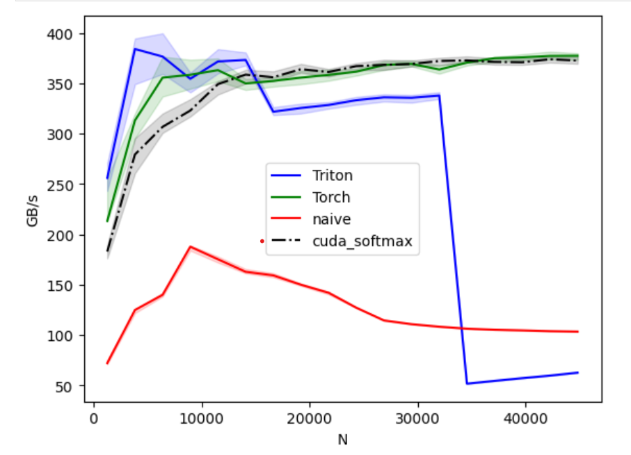
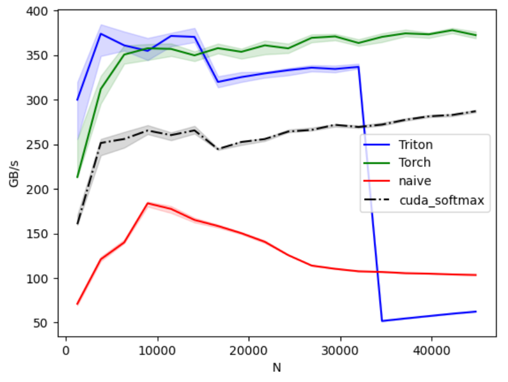

After unsuccessful attempts to optimize the triton kernel, let's see what we can do with the Cuda version.

Like triton, I highly suggest you get your hands dirty with kernel writing. It's ok to ask help from ChatGPT or your preferred AI.

As you can see in the following benchmark, my naive cuda version is even worse than my naive torch version.



If you look at my code you'll know why.

```cpp title="softmax_kernel.cu"
__global__ void softmax_kernel(const float *x, float *out, int input_row_stride, int output_row_stride,
                               int n_rows, int n_cols)
{
    int row = blockIdx.x;
    if (row >= n_rows)
        return;

    const float *row_in = x + row * input_row_stride;
    float *row_out = out + row * output_row_stride;

    // Step 1: find max value for numerical stability
    float max_val = -FLT_MAX;
    for (int j = 0; j < n_cols; ++j)
        if (row_in[j] > max_val)
            max_val = row_in[j];

    // Step 2: compute sum of exp(x - max)
    float sum_exp = 0.0f;
    for (int j = 0; j < n_cols; ++j)
        sum_exp += expf(row_in[j] - max_val);

    // Step 3: normalize
    for (int j = 0; j < n_cols; ++j)
        row_out[j] = expf(row_in[j] - max_val) / sum_exp;
}
```
If you didn't catch it, look at the following wrapper code.

```cpp title="softmax.cpp"
at::Tensor softmax_cuda(at::Tensor x)
{

    // Same as triton, pre-allocate the memory
    // torch::zeros_like(x) is the alternative, but slower
    auto out = torch::empty_like(x);
    int64_t M = x.size(0), N = x.size(1);


    int threads = 1;
    int64_t block_count = M;
    int blocks = static_cast<int>(block_count);

    // data_ptr<T>() extracts the actual memory address
    // Cuda kernels need raw memory pointer
    const float *x_ptr = x.data_ptr<float>();
    float *out_ptr = out.data_ptr<float>();

    cudaStream_t stream = c10::cuda::getCurrentCUDAStream();
    launch_softmax_kernel(x_ptr, out_ptr, x.stride(0), out.stride(0), M, N, blocks, threads, stream);
    C10_CUDA_CHECK(cudaGetLastError());
    return out;
}
```
We're utilizing just 1 thread, and assing each row to just 1 block. Basically the GPU is sitting mostly empty, begging to be used the money's worth.

## multi-threaded & shared memory
Now let's go multi-threaded. We will still have 1 block per row; just multiple threads per block.
Which means we're going to share each row with multiple threads. We need to put in some sync logic after each major step.

We define BLOCK_SIZE (which is the threads param), else we would get the following error:
```log
error: a variable length array cannot have static storage duration float shared_sum_exp[blockDim.x];
```

```cpp  title="softmax_kernel.cu"
__global__ void softmax_kernel_step1(const float *x, float *out, int input_row_stride,
                                     int output_row_stride, int n_rows, int n_cols)
{
#define BLOCK_SIZE 256
    int row = blockIdx.x;
    if (row >= n_rows)
        return;

    const float *row_in = x + row * input_row_stride;
    float *row_out = out + row * output_row_stride;

    // step 1: Each thread finds it's local max
    float local_max = -FLT_MAX;
    for (int j = threadIdx.x; j < n_cols; j += blockDim.x)
        local_max = fmaxf(local_max, row_in[j]);

    // only one thread writes final max
    __shared__ float max_val;
    __shared__ float shared_max[BLOCK_SIZE];
    shared_max[threadIdx.x] = local_max;
    __syncthreads(); // make sure all writes are done

    if (threadIdx.x == 0)
    {
        float global_max = -FLT_MAX;
        for (int t = 0; t < blockDim.x; ++t)
            global_max = fmaxf(global_max, shared_max[t]);
        max_val = global_max;
    }
    __syncthreads();

    float local_sum = 0.f;
    for (int j = threadIdx.x; j < n_cols; j += blockDim.x)
        local_sum += expf(row_in[j] - max_val);

    __shared__ float sum_exp;
    __shared__ float shared_sum_exp[BLOCK_SIZE];
    shared_sum_exp[threadIdx.x] = local_sum;
    __syncthreads();
    if (threadIdx.x == 0)
    {
        float total = 0.f;
        for (int t = 0; t < blockDim.x; ++t)
            total += shared_sum_exp[t];
        sum_exp = total;
    }

    __syncthreads();

    for (int j = threadIdx.x; j < n_cols; j += blockDim.x)
        row_out[j] = expf(row_in[j] - max_val) / sum_exp;
}
```
Now look at the results:


haha, at least better than naive version. But this takes fixed size arrays, we can use shared memory to go to dynamic array.

```cpp   title="softmax_kernel.cu"
__global__ void softmax_kernel_step2(const float *x, float *out, int input_row_stride,
                                     int output_row_stride, int n_rows, int n_cols)
{
    int row = blockIdx.x;
    if (row >= n_rows)
        return;

    extern __shared__ float shared[];

    const float *row_in = x + row * input_row_stride;
    float *row_out = out + row * output_row_stride;

    // step 1: Each thread finds it's local max
    float local_max = -FLT_MAX;
    for (int j = threadIdx.x; j < n_cols; j += blockDim.x)
        local_max = fmaxf(local_max, row_in[j]);

    // only one thread writes final max
    shared[threadIdx.x] = local_max;
    __syncthreads(); // make sure all writes are done

    // --- Parallel reduction for max
    for (int offset = blockDim.x / 2; offset > 0; offset >>= 1)
    {
        if (threadIdx.x < offset)
            shared[threadIdx.x] = fmaxf(shared[threadIdx.x], shared[threadIdx.x + offset]);
        __syncthreads();
    }
    float max_val = shared[0];
    __syncthreads();

    float local_sum = 0.f;
    for (int j = threadIdx.x; j < n_cols; j += blockDim.x)
        local_sum += expf(row_in[j] - max_val);

    shared[threadIdx.x] = local_sum; // reuse same buffer
    __syncthreads();

    // --- Parallel reduction for sum
    for (int offset = blockDim.x / 2; offset > 0; offset >>= 1)
    {
        if (threadIdx.x < offset)
            shared[threadIdx.x] += shared[threadIdx.x + offset];
        __syncthreads();
    }
    float sum_exp = shared[0];
    __syncthreads();

    for (int j = threadIdx.x; j < n_cols; j += blockDim.x)
        row_out[j] = expf(row_in[j] - max_val) / sum_exp;
}
```

I did not observe any specific perf gains here, because the solution is essentially like the fixed sized shared arrays.

## memory coalescing & vectorized float4 loads
Probably from the add kernel you remember vectorized float4 loads. It gave us good perf boost on  Add kernel, let's see how it works here.



The above diagram is what we get for $$ threads=256 $$. And the following is what we get for $$ threads=1024 $$.


We can marry best of both worlds with this condition:
```cpp
    int threads = 512; // or 256
    if ( N > 14080 )
        threads = 1024;
```
which gives us:


voila, we are not in a bad position at all. We have surpassed the naive version; and Triton kernel for $$ N > 14080 $$.

Here is the code for vectorized memory access:

```cpp title="softmax_kernel.cu"
__global__ void softmax_kernel_step3_vec4(
    const float *__restrict__ x,
    float *__restrict__ out,
    int in_stride, int out_stride,
    int n_rows, int n_cols)
{
    int row = blockIdx.x;
    if (row >= n_rows)
        return;

    extern __shared__ float shared[]; // reuse the same buffer
    const float *__restrict__ row_in = x + row * in_stride;
    float *__restrict__ row_out = out + row * out_stride;

    // pass 1, local max, vectorized
    float local_max = -FLT_MAX;
    int n_vec = n_cols >> 2; // n_cols / 4
    for (int j4 = threadIdx.x; j4 < n_vec; j4 += blockDim.x)
    {
        float4 v = reinterpret_cast<const float4 *>(row_in)[j4];
        local_max = fmaxf(local_max, v.x);
        local_max = fmaxf(local_max, v.y);
        local_max = fmaxf(local_max, v.z);
        local_max = fmaxf(local_max, v.w);
    }
    // tail, if any, handle with first few threads
    int tail_start = n_vec << 2;
    for (int j = tail_start + threadIdx.x; j < n_cols; j += blockDim.x)
    {
        local_max = fmaxf(local_max, row_in[j]);
    }

    shared[threadIdx.x] = local_max;
    __syncthreads();

    // parallel reduction for max
    for (int off = blockDim.x >> 1; off > 0; off >>= 1)
    {
        if (threadIdx.x < off)
            shared[threadIdx.x] = fmaxf(shared[threadIdx.x], shared[threadIdx.x + off]);
        __syncthreads();
    }
    float max_val = shared[0];
    __syncthreads();

    // pass 2, write exp(x - max) to out, accumulate sum, vectorized
    float local_sum = 0.f;
    for (int j4 = threadIdx.x; j4 < n_vec; j4 += blockDim.x)
    {
        float4 v = reinterpret_cast<const float4 *>(row_in)[j4];
        v.x = expf(v.x - max_val);
        v.y = expf(v.y - max_val);
        v.z = expf(v.z - max_val);
        v.w = expf(v.w - max_val);
        local_sum += v.x + v.y + v.z + v.w;
        reinterpret_cast<float4 *>(row_out)[j4] = v; // store unnormalized exp
    }
    for (int j = tail_start + threadIdx.x; j < n_cols; j += blockDim.x)
    {
        float e = expf(row_in[j] - max_val);
        local_sum += e;
        row_out[j] = e;
    }

    shared[threadIdx.x] = local_sum;
    __syncthreads();

    // parallel reduction for sum
    for (int off = blockDim.x >> 1; off > 0; off >>= 1)
    {
        if (threadIdx.x < off)
            shared[threadIdx.x] += shared[threadIdx.x + off];
        __syncthreads();
    }
    float sum_exp = shared[0];
    __syncthreads();

    // pass 3, normalize, vectorized
    for (int j4 = threadIdx.x; j4 < n_vec; j4 += blockDim.x)
    {
        float4 v = reinterpret_cast<const float4 *>(row_out)[j4];
        v.x /= sum_exp;
        v.y /= sum_exp;
        v.z /= sum_exp;
        v.w /= sum_exp;
        reinterpret_cast<float4 *>(row_out)[j4] = v;
    }
    for (int j = tail_start + threadIdx.x; j < n_cols; j += blockDim.x)
    {
        row_out[j] /= sum_exp;
    }
}
```

## warp-optimized reduction
I got this from chatgpt and included in the code; but didn't get much benefits.
I include the result here FYI.

